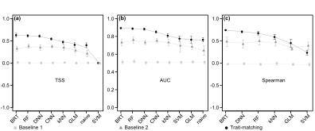

## Pichler et al. Machine Learning to predict species interactions
* Installation
  - [Prerequisites](#pre)
  - [Data availability](#ava)
* Results
  - [Figure 2](#fig2)
  - [Figure 3](#fig3)
  - [Figure 4](#fig4)
  - [Figure 5](#fig5)
  - [Figure S1](#figs1)
  - [Figure S2](#figs2)
  - [Figure S3](#figs3)
  - [Figure S4](#figs4)
  - [Figure S5](#figs5)
  

### Prerequisites <a name="pre"></a>
```{r}
# TM dependencies:
install.packages(c("mlr","keras", "tfprobability", "ranger", "kknn", "xgboost", "missForest", "snow", "liquidSVM"))

devtools::install_github(repo = "https://github.com/TheoreticalEcology/Pichler-et-al-2019", subdir = "TraitMatching")
devtools::install_github(repo = "https://github.com/MaximilianPi/Aranea")

```
For a minimal example, see [code](https://github.com/TheoreticalEcology/Pichler-et-al-2019/tree/master/TraitMatching)


### Data availability <a name="ava"></a>
- Global plant-pollinator database: [https://doi.org/10.6084/m9.figshare.9980471.v1](https://doi.org/10.6084/m9.figshare.9980471.v1)
- Plant-hummingbird networks: [https://doi.org/10.6084/m9.figshare.3560895.v1](https://doi.org/10.6084/m9.figshare.3560895.v1) see original publication Maglianesi et al. 2014 (DOI: 10.1890/13-2261.1)


### Figure 2 <a name="fig2"></a>



<figcaption>Figure 2: Predictive performance of kNN, CNN, DNN, RF, BRT, naive Bayes, GLM and SVM with simulated plant-pollinator networks (50 plants * 100 pollinators) for baseline scenarios with random interactions and even or uneven species abundances (squares and triangles, respectively), and trait-based interactions with even species abundances (circles). Predictive performance was measured by TSS (a) and AUC (b) for binary interaction data; and Spearman Rho factor (c) for interaction counts. Lowest predictive performance corresponds to zero for TSS, AUC, and Spearman Rho factor.</figcaption>


### Figure 3 <a name="fig3"></a>


<figcaption>Figure 3: Predictive performance of different ML methods (naive Bayes, SVM, BRT, kNN, DNN, CNN, RF) and GLM in a global database of plant-pollinator interactions. Dotted lines depict training and solid lines validation performances. Models were sorted from left to right with increasing true skill statistic. The central figure compares directly the models’ performances. Sen = Sensitivity (recall, true positive rate); Spec = Specificity (true negative rate); Prec = Precision; Acc = Accuracy; AUC = Area under the receiver operating characteristic curve (AUC); TSS in % = True skill statistic rescaled to 0 – 1.</figcaption>


### Figure 4 <a name="fig4"></a>


<figcaption>Figure 4: Comparison of the top predictive models’ (RF, DNN, BRT, kNN, and GLM) abilities to infer the causal trait-trait interaction structure in simulated networks, using presence-absence data (a) and count data (b). We show the average true positive rate (TPR) and its standard error for one to four true trait-trait interactions based on 8-10 replicate simulations each. Solid red lines display the mean TPR across the interaction scenarios, dotted red lines show a linear regression estimate of TPR against the number of true trait-trait interactions.</figcaption>


### Figure 5 <a name="fig5"></a>


<figcaption>Figure 5: a) Elevation profile for the three plant-hummingbird networks in Costa Rica (details see Maglianesi et al. 2014; b) The eight strongest trait-trait interactions (blue – yellow gradient) inferred with the H-statistic from RF models fitted to the combined plant-hummingbird network (colors code the ranking of strengths). Corolla length – bill length and corolla curvature – bill length had the highest interaction strengths.</figcaption>


### Figure S1 <a name="figs1"></a>

<figcaption>Figure S1: Unlogged and logged fraction of two trait-trait matches.</figcaption>


### Figure S2 <a name="figs1"></a>

<figcaption>Figure S2: Predictive comparison of machine learning models for varying network sizes (a-c) and varying observation times (d-f). We compared three network sizes (20x50, 50x100, and 100x200 speciesxspecies), for presence-absence plant-pollinator interactions (a, b) and plant-pollinator interaction counts , (c) and three observation times (0.007, 0.0032, 0.12) for presence-absence plant-pollinator interactions (d, e) and plant-pollinator interaction counts (f). We used TSS (true skill statistic) and AUC (area under the curve) for estimating predictive performance for presence-absence (a, b, d, e) and Spearman Rho correlation factor for count frequencies (c, f). </figcaption>


### Figure S3 <a name="figs1"></a>

<figcaption>Figure S3: Averaged true positive rates for causal inferential performance on a 50*100 simulated plant-pollinator network. We tested the performance for DNN and BRT on one to four true trait-trait interactions. Red line is the averaged mean of true positive rates. Results were higher for species presence-absence (a) interactions than for species interaction counts. </figcaption>

### Figure S4 <a name="figs1"></a>

<figcaption>Figure S4: For estimating the predictive power of random forest, BRT, DNN with a negative binomial log-likelihood, and a DNN with a Poisson log-likelihood, we plotted the true observations versus the predictions. BRT and random forest showed best fits. Spearman rho correlation was used to quantify the predictive power and therefor the fit.</figcaption>


### Figure S5 <a name="figs1"></a>

<figcaption>Figure S5: Low network - BRT, DNN with poisson log-likelihood, DNN with negative binomial log-likelihood, and random forest were fit to the low plant-hummingbird network. The four traits with highest interaction strength versus all traits and for each of those the top two pairwise interactions were here visualized. Random forest identified mainly trait combinations between plants and hummingbirds with higher interaction strengths.</figcaption>